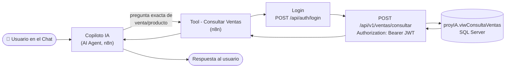
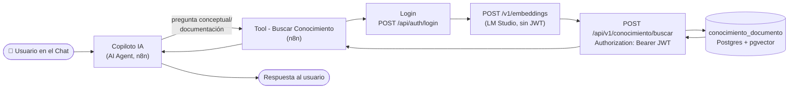
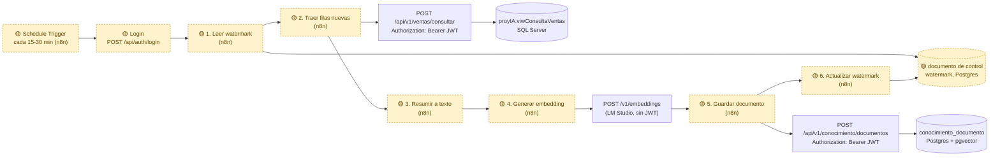

# Propuesta: sincronización incremental de Ventas hacia la base vectorial

> **Estado: 🟡 Propuesta de diseño, no implementada.** Ninguno de los pasos de este documento
> existe todavía en n8n ni en ApiKnowledge — es la respuesta a la pregunta del equipo de "¿se
> puede conectar SQL Server con Postgres para pasar la info de la vista a la vectorial?",
> documentada para discutirla antes de construirla.

Este documento es una aplicación **concreta** del principio general ya definido en
[`SINCRONIZACION_SQLSERVER_POSTGRES.md`](SINCRONIZACION_SQLSERVER_POSTGRES.md) (las dos bases
nunca se conectan directamente, todo pasa por API), pero usando las piezas que **ya existen y
funcionan hoy** — `ApiKnowledge`, n8n, LM Studio — en vez del `ApiAsp` hipotético de ese
documento. Se guarda como archivo separado porque ese otro documento describe una investigación
abierta y sin decisión tomada; este describe un flujo concreto y accionable sobre
infraestructura que ya está corriendo.

## Aclaración importante: los vectores NO hacen las consultas más rápidas

Una idea que se planteó en el equipo fue: convertir los datos transaccionales de SQL Server en
vectores para que **la consulta sea más rápida**. Vale la pena aclararlo explícitamente porque es
un malentendido común, pero no es así:

- Un vector no es una versión "comprimida" o "indexada" más rápida de un dato exacto — es una
  representación numérica del **significado** de un texto, pensada para encontrar cosas
  *parecidas*, no para encontrar un dato *exacto* más rápido.
- La búsqueda vectorial es, por diseño, **aproximada** (ANN — "approximate nearest neighbor"):
  devuelve lo más similar al vector de búsqueda, no garantiza el resultado exacto. Para un dato
  como "¿cuánto vendió el cliente X el 3 de julio?" eso es exactamente lo que **no** se quiere —
  se necesita el número real, no "un número parecido".
- Para datos exactos y estructurados, un **índice normal de SQL Server** (B-tree) ya es más
  rápido que cualquier búsqueda vectorial, y encuentra el dato exacto en vez de uno aproximado.
  No es una afirmación teórica: lo comprobamos nosotros mismos en este mismo proyecto — el query
  de `Consultar Ventas` sin un filtro de fecha bien aprovechado hacía **87,347 lecturas lógicas**
  contra `tbl_Documento`; usando el índice `INX_Fecha_Documento` correctamente, la misma consulta
  baja a **3 lecturas** (detalle completo en el problema #7 de
  [`N8N-Workflow-Copiloto-IA-Agent.md`](N8N-Workflow-Copiloto-IA-Agent.md)). Ningún vector le
  gana a eso.
- Convertir un monto o una fecha en vector, entonces, no solo no ayuda — lo haría **más lento y
  menos confiable**, porque cambia un dato exacto por una búsqueda de similitud aproximada.

**En resumen**: "vectorizar para que sea más rápido" mezcla dos problemas distintos. Rapidez en
datos exactos se resuelve con buen indexado en SQL Server (ya resuelto para Ventas, ver el
problema #7 del documento de arriba). Los vectores resuelven un problema distinto — encontrar
información por significado en texto no estructurado (documentación, políticas, resúmenes) —
que es para lo que sí tiene sentido el módulo de Conocimiento. Por eso este documento no propone
vectorizar los datos transaccionales tal cual, sino generar **texto resumido** a partir de ellos
para casos de uso conceptuales — ver la siguiente sección.

## ¿Tiene sentido vectorizar Ventas?

No siempre. La búsqueda semántica (vectores) sirve para encontrar **texto por significado**
("¿qué política tenemos de descuentos?"). Los datos de Ventas (fecha, cliente, producto, monto)
son datos **exactos y estructurados** — ya se resuelven bien y en tiempo real con la herramienta
`Consultar Ventas` (SQL directo a `proyIA.viwConsultaVentas`, ver
[`N8N-Workflow-Copiloto-IA-Agent.md`](N8N-Workflow-Copiloto-IA-Agent.md)). Vectorizar un monto no
lo hace más fácil de encontrar, y agrega el riesgo de que el LLM responda con una cifra
desactualizada o "redondeada" desde un documento indexado en vez del dato real — el mismo riesgo
que ya advierte `SINCRONIZACION_SQLSERVER_POSTGRES.md`.

**Donde sí tendría sentido**: si el equipo quiere que el copiloto responda preguntas *abiertas*
sobre patrones o contexto de ventas que no son una fila exacta — por ejemplo resúmenes por
periodo, notas de vendedor, o descripciones de comportamiento de un cliente. En ese caso el
"documento" a indexar no sería cada fila cruda de la vista, sino un **texto ya resumido/generado**
a partir de esas filas (por ejemplo: *"En julio 2026, el cliente X compró 12 veces por el canal
Rutas Propias, con un total de ₡450,000, principalmente productos de la línea Y."*).

## Principio: sincronización incremental, no una copia completa cada vez

Igual que documenta `SINCRONIZACION_SQLSERVER_POSTGRES.md`, esto sería un **proceso de indexado
por lotes** (n8n lee → transforma a texto → genera embedding → guarda en Postgres vía
`ApiKnowledge`), no una conexión en vivo entre las dos bases. La diferencia frente a un lote
completo (re-indexar todo desde cero cada vez) es un **watermark**: guardar en algún lado la
última fecha ya procesada, y que cada corrida solo traiga filas más nuevas que esa fecha.

- **Dónde vive el watermark**: la opción más simple es una fila de control en la propia tabla
  `conocimiento_documento` de Postgres (un documento especial tipo `Tipo_Documento = 'watermark'`
  con la última fecha procesada), para no depender de storage externo a n8n. Alternativa:
  un [Data Table de n8n](https://docs.n8n.io) si el equipo prefiere no mezclarlo con la tabla de
  conocimiento.
- **Cada cuánto corre**: un `Schedule Trigger` en n8n, por ejemplo cada 15-30 minutos. Se puede
  ajustar según qué tan al día se necesite tener el índice — no hay una respuesta única, es una
  decisión de negocio (ver la pregunta abierta en `SINCRONIZACION_SQLSERVER_POSTGRES.md`: *"¿cada
  cuánto se considera aceptable que el conocimiento esté desactualizado?"*).
- **Por qué no CDC/eventos en tiempo real todavía**: SQL Server sí soporta Change Data Capture,
  pero es infraestructura adicional (habilitarlo a nivel de base, un proceso que lo consuma) que
  hoy no está montada. Para el caso de uso de Ventas (resúmenes/contexto, no saldos en vivo), un
  rezago de minutos es aceptable — se recomienda no construir CDC hasta que exista un caso de uso
  que realmente lo necesite.

## Proceso paso a paso

1. **Leer el watermark** — n8n consulta cuál fue la última `Fecha_Documento` procesada en la
   corrida anterior (documento de control en Postgres, ver arriba).
2. **Traer filas nuevas** — llamar `POST /api/v1/ventas/consultar` (el endpoint que ya existe,
   `VentasService.ConsultarVentas`) con `fechaInicio` = watermark y `fechaFin` = ahora. No hace
   falta ningún endpoint nuevo en ApiKnowledge para este paso.
3. **Agrupar/resumir** — dentro de n8n (nodo `Code` o `Aggregate`), agrupar las filas crudas en
   el texto que realmente se quiere hacer buscable (por cliente, por periodo, por producto —
   según el caso de uso real que se decida). Este es el paso que hoy **no existe en ningún lado**
   y es la parte que más depende de qué pregunta se quiere que el copiloto conteste después.
4. **Generar el embedding** — llamar `POST /v1/embeddings` de LM Studio
   (`text-embedding-nomic-embed-text-v1.5`) sobre cada texto resumido, igual que ya hace hoy
   `Tool - Buscar Conocimiento`.
5. **Guardar en Postgres** — `POST /api/v1/conocimiento/documentos` en ApiKnowledge (endpoint que
   ya existe para el módulo de Conocimiento), con el texto y su embedding.
6. **Actualizar el watermark** — escribir la nueva `Fecha_Documento` máxima procesada, para que la
   siguiente corrida no vuelva a traer las mismas filas.

## Autenticación: n8n nunca toca el ERP directo — todo pasa por JWT

Antes de ver los diagramas, tres preguntas concretas que hay que tener claras porque los
diagramas las dan por hechas: **desde dónde se conecta n8n al ERP**, **para qué es el login**, y
**qué endpoints exigen el JWT**.

### ¿Desde qué parte se conecta n8n al ERP (SQL Server)?

Nunca directo. n8n **no tiene, y no debe tener, ninguna cadena de conexión a SQL Server** — ni al
ERP transaccional ni a Postgres. El único punto de contacto es HTTP, contra `ApiKnowledge`:

```
n8n (Docker) --HTTPS--> https://host.docker.internal:7225/... --> ApiKnowledge (.NET 8) --> SQL Server
```

`ApiKnowledge` es quien físicamente abre la conexión ADO.NET a SQL Server (o a Postgres, para
Conocimiento); n8n solo sabe hacer peticiones HTTP a esos endpoints. `host.docker.internal` se
usa en vez de `localhost` porque n8n corre dentro de un contenedor Docker y ApiKnowledge corre en
el host — el detalle completo de por qué está en
[`N8N-Workflow-IA-Generativa.md`](N8N-Workflow-IA-Generativa.md#red-cómo-n8n-en-docker-le-llega-a-apiknowledge-en-el-host).
Esto aplica igual de estricto al workflow de sincronización propuesto en este documento: en
ningún paso n8n hablaría directo con SQL Server ni con Postgres, siempre a través de un endpoint
de ApiKnowledge.

### El login: ¿para qué sirve?

`POST /api/auth/login` no devuelve datos de negocio — devuelve un **JWT** (`Data[0].Token`), que
es lo único que hace falta para poder llamar cualquier otro endpoint protegido después. El
mecanismo real, de punta a punta:

1. El nodo `Login` (dentro de cada sub-workflow-herramienta) manda un usuario y contraseña reales
   de SQL Server — hoy el usuario de prueba `deved04`/`2026`, creado para el equipo con la misma
   configuración que `r33` (ver la sección de usuarios de prueba en
   [`ApiKnowledge-Guia-Implementacion.md`](ApiKnowledge-Guia-Implementacion.md)).
2. `ApiKnowledge` valida esas credenciales **contra SQL Server**, vía el stored procedure
   `PA_bsc_User_2` (`@pOpcion=1`) — el mismo mecanismo de login que ya usa el sistema real, no uno
   nuevo inventado para la IA.
3. Si el login es válido, `AuthController` genera y devuelve el JWT.
4. Ese JWT se guarda en la variable del workflow (`$('Login').item.json.data[0].token`) y se
   adjunta como header `Authorization: Bearer <token>` en cada llamada protegida que sigue,
   **dentro de esa misma ejecución**.

**Importante**: el token no se reutiliza entre ejecuciones. Cada vez que el chat dispara al
Copiloto, o que (en la propuesta) el `Schedule Trigger` dispara una corrida de sincronización, esa
ejecución hace **su propio login** desde cero — no hay una sesión persistente ni un token
cacheado entre corridas.

### ¿Qué endpoints exigen el JWT y cuáles no?

| Endpoint | Requiere JWT (`[Authorize]`) | Por qué |
|---|---|---|
| `POST /api/auth/login` | ❌ No | Es el que **emite** el JWT — exigirlo sería una dependencia circular. |
| `GET /api/status` | ❌ No | Healthcheck, sin datos de negocio. |
| `POST /api/v1/ventas/consultar` | ✅ Sí | Datos transaccionales reales de SQL Server. |
| `POST /api/v1/conocimiento/buscar` | ✅ Sí | Lee el contenido indexado en Postgres. |
| `POST /api/v1/conocimiento/documentos` | ✅ Sí | Escribe en Postgres — el endpoint que usaría el paso 5 de la sincronización propuesta. |

Nota aparte: **LM Studio no exige ningún JWT ni credencial real** (ver
[`LM_STUDIO_SETUP.md`](../instalaciones/LM_STUDIO_SETUP.md)) — el JWT de ApiKnowledge es un
mecanismo completamente separado que solo aplica a las llamadas hacia ApiKnowledge, nunca a las
llamadas hacia LM Studio.

**Para el workflow de sincronización propuesto**: los pasos 2 (`traer filas nuevas`, llama
`/ventas/consultar`) y 5 (`guardar documento`, llama `/conocimiento/documentos`) **sí**
necesitarían el JWT — un nodo `Login` al inicio de la corrida, igual que en los workflows que ya
existen. El paso 4 (embedding) no lo necesita, porque le habla a LM Studio, no a ApiKnowledge.
Dónde vive el watermark (pasos 1 y 6) sigue siendo una decisión abierta (ver la checklist más
abajo) — si termina viviendo en Postgres vía un endpoint de ApiKnowledge, también necesitaría el
mismo JWT; si vive en un Data Table de n8n, no pasa por ApiKnowledge en absoluto y no aplica.

## Diagramas de flujo (uno por herramienta, para que no se crucen las líneas)

Cada diagrama es un flujo lineal, de izquierda a derecha, por columnas = quién hace qué
(n8n → LM Studio/ApiKnowledge → base de datos). Los primeros dos son lo que **ya está
funcionando hoy** en `Copiloto IA Generativa`; el tercero es la parte **🟡 propuesta, todavía no
construida** de este documento.

### 1. Flujo actual — "Consultar Ventas" (dato exacto, tiempo real)



### 2. Flujo actual — "Buscar Conocimiento" (búsqueda semántica, tiempo real)



### 3. Flujo propuesto — "Sync Ventas → Vectorial" (batch, programado, sin chat de por medio)



Lectura de los tres diagramas:

- Los diagramas 1 y 2 son exactamente lo que ya está publicado y probado hoy (ver
  [`N8N-Workflow-Copiloto-IA-Agent.md`](N8N-Workflow-Copiloto-IA-Agent.md)) — el agente elige uno
  u otro según la pregunta, y ninguno de los dos toca la base de datos del otro.
- El diagrama 3 (en amarillo, con 🟡) es el workflow nuevo que habría que construir: corre solo,
  programado, sin que el chat lo dispare — su único trabajo es mantener Postgres al día con un
  resumen de lo que pasa en SQL Server.
- Los nodos **sin** 🟡 dentro del diagrama 3 (`POST /api/v1/ventas/consultar`,
  `POST /v1/embeddings`, `POST /api/v1/conocimiento/documentos`) **ya existen** y ya se usan en
  los diagramas 1 y 2 — el flujo de sincronización los reutiliza tal cual, no requiere construir
  ningún endpoint nuevo en ApiKnowledge ni en LM Studio, solo el `Login` y los 6 pasos nuevos en
  n8n (ver la sección de autenticación arriba: el `Login` es igual de obligatorio aquí que en los
  otros dos flujos, para poder llamar `/ventas/consultar` y `/conocimiento/documentos`).

## Qué falta decidir/construir antes de implementarlo

- [ ] **Definir el caso de uso real** — qué pregunta abierta se quiere que el copiloto conteste
  sobre Ventas que hoy no puede (esto determina qué texto se genera en el paso 3, es la pieza más
  importante y la única que no se puede resolver solo con ingeniería).
- [ ] Decidir dónde vive el watermark (documento de control en Postgres vs. Data Table de n8n).
- [ ] Decidir la frecuencia del `Schedule Trigger`.
- [ ] Construir el nuevo workflow de n8n (`Sync Ventas → Vectorial`) con los 6 pasos de arriba.
- [ ] Decidir si el agente necesitaría una **tercera herramienta** ("Buscar Insights de Ventas")
  para consultar este nuevo contenido, distinta de `Buscar Conocimiento` y `Consultar Ventas`, o
  si se indexa dentro de la misma colección de Conocimiento.

## Ver también

- [`SINCRONIZACION_SQLSERVER_POSTGRES.md`](SINCRONIZACION_SQLSERVER_POSTGRES.md) — el principio
  general (por qué nunca se conectan las dos bases directo, batch vs. eventos) del que este
  documento es una aplicación concreta.
- [`N8N-Workflow-Copiloto-IA-Agent.md`](N8N-Workflow-Copiloto-IA-Agent.md) — cómo funcionan hoy
  las dos herramientas reales del copiloto (`Consultar Ventas`, `Buscar Conocimiento`).
